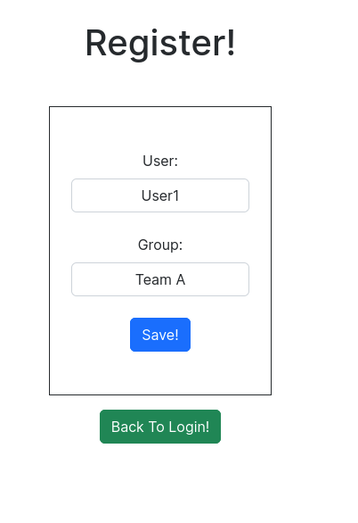
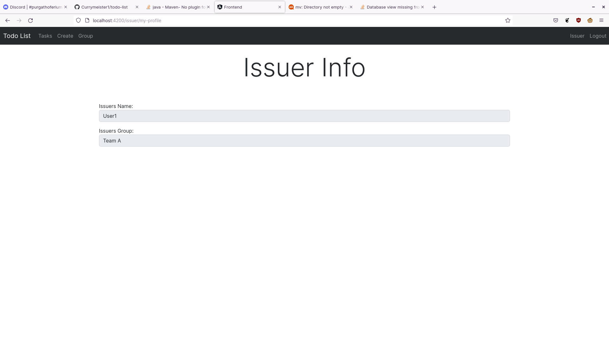
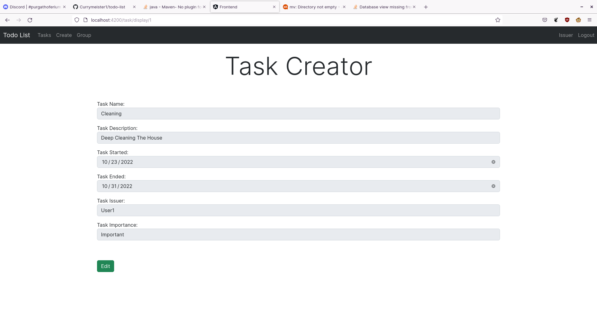
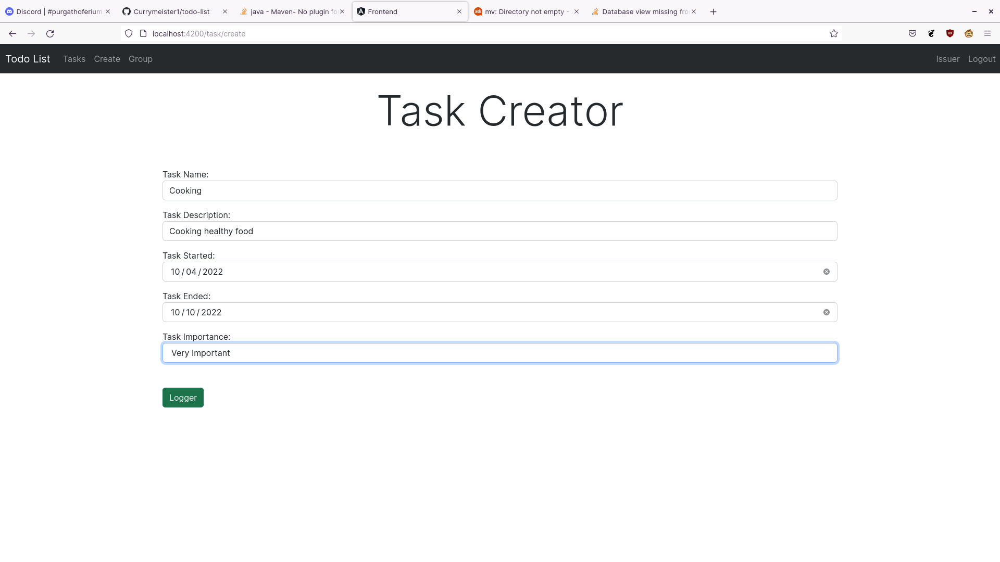
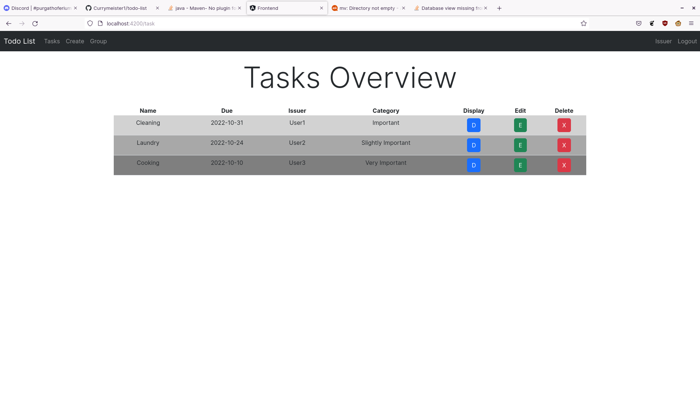
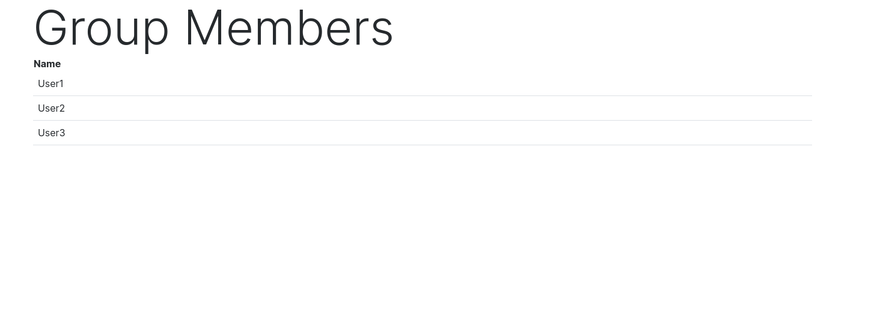

# todo-list

A simple group based todo-list webapp. Users can be a part of group and create tasks which can be seen by other members.

## Register to a group.

## Profile page containing information about the user.

## See the full information on a task

## Create a task

## See the list of tasks for your group

## See who else is in the group
